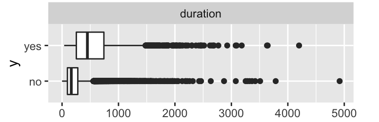
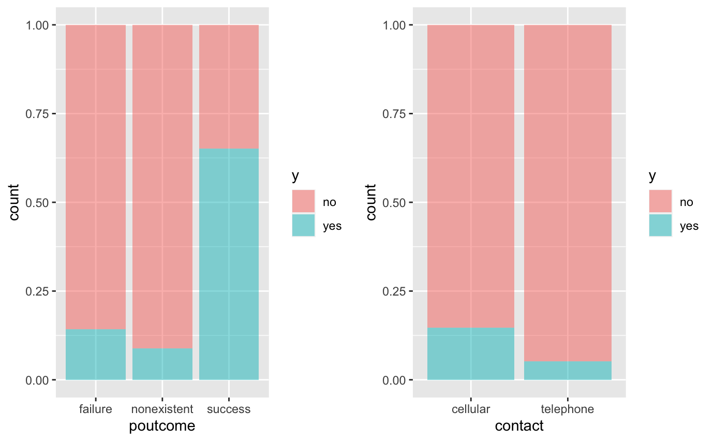
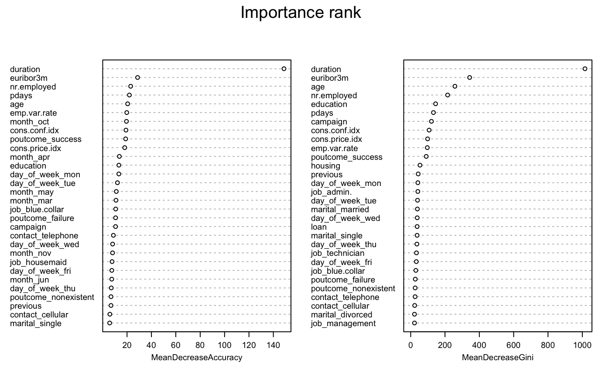
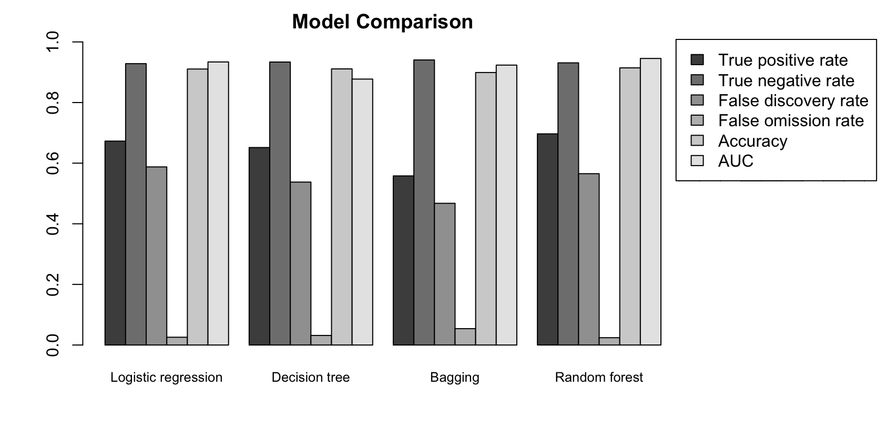
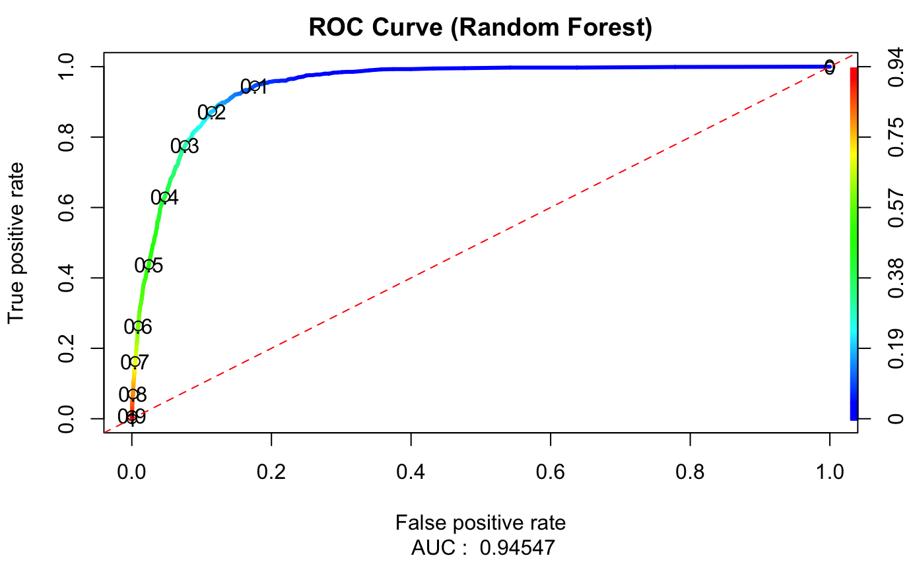
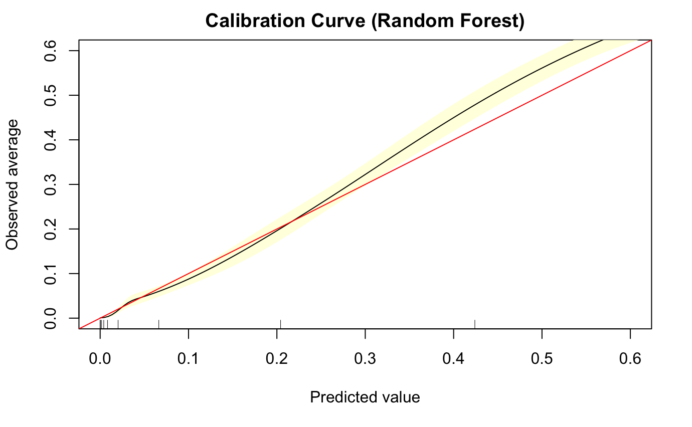
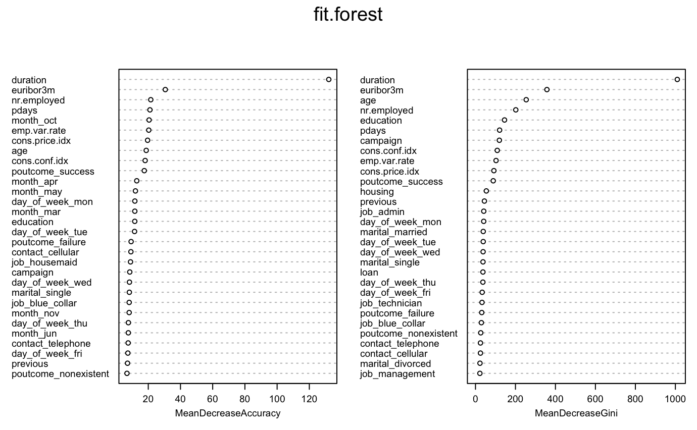

```{r setup, include=FALSE}
knitr::opts_chunk$set(echo = TRUE)
```

## Part I: Executive summary

A revenue decline has been noticed in a Portuguese bank institution, and a further analysis led to the cause that there were less customers who subscribed to a deposit.
Since term deposits provide with better revenues, the bank needs know what kind of customers are more likely to subscribe a term deposit to conduct phone call marketing campaigns.

So, the objective is to find the most important factor that promote marketing campaigns most and provide guidance to locate customers that are willing to subscribe.



Based on the previous telemarketing data, we can see from the *duration* figure that the contact duration with subscribed customers is much longer than unsubscribed ones, indicating that contact duration may play an important role in direct marketing campaigns.


we can see from the *poutcome* figure that the probability of customers who used to purchase bank products continuing to buy is much higher. The reason may be that, compared with other wealth management products, the term deposit risk is lower.

From *contact* plot, we can see that subscribed customers are likely to be contacted through mobile phones, probably because mobile phones are easier for bank staff to reach customers.



The result of our model is listed above.
As we can see in the figure above, *duration* is at the top of the importance rank, meaning that *duration* has a great influence on whether the customer subscribes for a term deposit or not.

And through decision tree model, we know the thresholds for contact duration is 202 seconds (approximately 3 minutes) and 532 seconds (approximately 8 minutes). If the bank staff call duration is less than 202 seconds, the chance of unsubscribing is of 78%, which indicates a high chance of failure. While if bank staff call duration is more than 532 seconds, the chance of subscribing is of 88%. Besides, if the call duration is between 202 seconds and 532 seconds, he chance of subscribing is around 64%.


\newpage
## Part II: Technical summary
- Initial data exploration

This dataset is UCI Bank Marketing (with social/economic context) dataset and is consisted of 41,188 customer data on telemarketing of a Portuguese banking institution. Normally, the banking institution staff need to contact customers at least once to find out whether the customer is willing to subscribe for a term deposit. 

This dataset has 1 classification response is whether the customer subscribes for a term deposit (*y*: yes or no).
And it contains 20 variables, including 10 numeric variables (*age *, *duration* (last contact duration), *campaign* (number of contacts performed), *pdays* (number of days since last contact), *previous* (number of contacts performed before), *emp.var.rate* (employment variation rate), *cons.price.idx* (consumer price index), *cons.conf.idx* (consumer confidence index), *euribor3m* (euribor 3 month rate), *nr.employed* (number of employees)) and 10 categorical variables (*job*, *marital*, *education*, *default* (credit default status), *housing* (whether has housing loan), *loan* (whether has personal loan), *contact* (contact communication type), *month* (last contact month of year), *day_of_week* (last contact day of the week), *poutcome* (outcome of the previous marketing campaign)).


- Strategies with missingness

There is no missing data in numeric variables, but there exist “unknown” values in categorical variables which are treated as missing data.

In the dataset, there are 330 “unknown” values in *job* variable, accounting for 0.08% and 80 “unknown” in *marital* (0.02%). Since the missingness only accounts for a tiny part for these two variables, I directly deleted the missing values.

However, there are lots of missing values in *education*, *default*, *housing* and *loan*. I built classification and regression tree models to predict the missing values for these four variables.


- Data coding or feature engineering

For categorical variables, I did data coding with three coding methods. 

Firstly, I did binary coding for *y*, *default*, *housing* and *loan* with 1 for “yes” and 0 for “no”. 

Secondly, I did ordinal coding for *education* with 1 to 7 standing for different education levels in order. 

Thirdly, I did one-hot coding for *job*, *marital*, *contact*, *month*, *day_of_week* and *poutcome*.

For numeric variables, since they are in different units, scaling was implemented after data splitting.


- Train/test/validate

The data was split into three parts: training set (50%), validating set (25%), and testing set (25%). Training set is used for initial model fitting, validating set is used for parameter adjusting and model selection and testing set is for model assessment.


- Model design
In the beginning, I built three models: logistic regression, decision tree and random forest. But later, I found that the performance of decision tree model was not satisfying. So, I further used bagging for classification trees.
Three-fold cross validation resampling was used to train the model, and we also used ROC as the evaluation metric.

After training, fitted models are assessed and compared through validating set. And I chose confusion matrices, accuracy, ROC and AUC as assessment metrics.


- Model selection

If we refer customers who are willing to subscribed a term deposit as valuable customers.
Ture positive represents the predicted valuable customers are actually the valuable ones. 
False positive indicates the resource wasted for acquiring predicted valuable customers who actually will not subscribe a term deposit.
False negative indicates the potential valuable customers neglected duo to false prediction.
Ture negative represents that those predicted not to be valuable customers are actually not subscribing a term deposit.

I focused on the four values of confusion matrices, true positive rate (true positive / (true positive + false negative)), true negative rate (true negative / (true negative + false positive)), false discovery rate (false positive / (true positive + false positive)), false omission rate (false negative / (true negative + false negative)).
True positive rate and true negative rate measure how precise the prediction is and how well we can rely on the prediction values. And higher they are, better the model performs.
False discovery rate indicates the resource wasted for acquiring predicted valuable customers who actually will not subscribe a term deposit. False omission rate indicates the potential valuable customers neglected duo to false prediction. And lower they are, better the model performs.

ROC and AUC measure how well the model performs in classification. AUC closer to 1 indicates better performance.


As we can see in the figure above, random forest has highest true positive rate, accuracy and AUC. And random forest relatively low false omission rate. So, we select random forest as the most suitable model for this problem.


- Hyperparameter tuning

There are some hyperparameters that we need to tune for random forest model and the main hyperparameters list as below:

Number of trees to grow in the forest *ntrees*

Number of variables randomly sampled as candidates at each split *mtry*

Size(s) of sample to draw *sampsize*

Minimum size of terminal nodes *nodesize*

Maximum number of terminal nodes trees in the forest can have *maxnodes*

Among them, *ntrees* and *mtry* have the largest influence on predictive accuracy and I focused on these two parameters. And I used random grid search as tuning strategy.

Normally, we need a sufficiently large *ntrees* to make sure that the error rate will stabilize at a certain level. In this case, I chose a set of values 10 times the number of features to start with.

For *mtry*, with fewer relevant predictors, a high value tends to perform better, and with many relevant predictors, a low value tends to perform better.


- Model performance and interpretation

After getting the best parameter set for random forest model, I tested the final model on the testing set.

The accuracy is 0.9143, indicating that the model preforms well in predicting.

For confusion matrices, the true negative rate is 0.931, but the true positive rate is low, only 0.70. False omission rate is 0.0243, indicating good performance in avoiding neglecting valuable customers, but the false discovery rate, indicating resource waste exist into promoting products to customers who has less willingness to buy it.


For ROC and AUC, as we can see, the AUC value is 0.95, which is very close to 1, indicating that this model performs well in classification.


As we can see in the calibration curve figure, the model predicted well for lower observed response, however the gap got wider with observed average going up.


At last, random forest model can generate the importance rank for each variable. As we can see in the figure, the importance value of *duration* is much higher than all the other variables, indicating that *duration* has a great influence on whether the customer subscribes for a term deposit or not.


